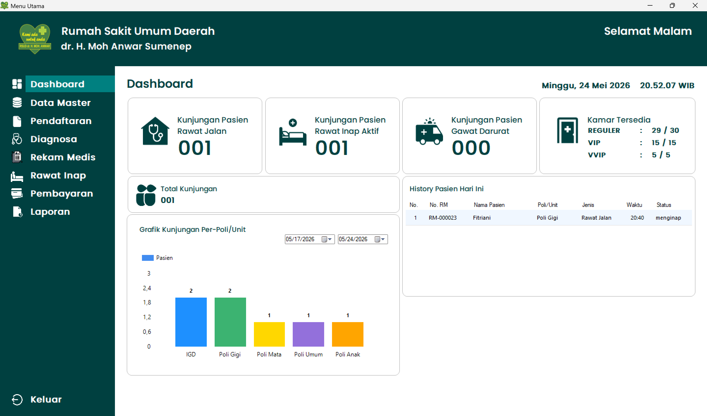
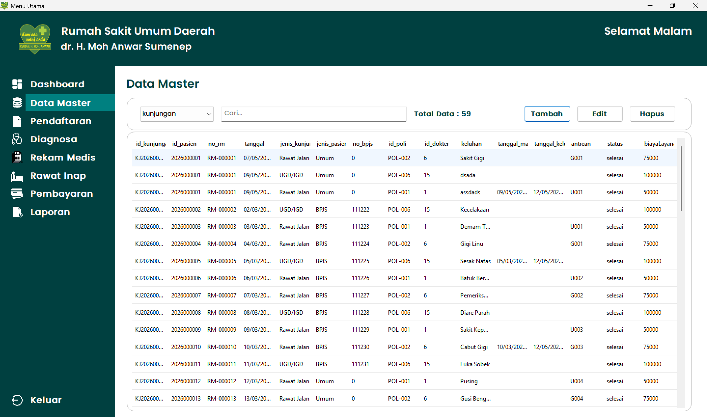
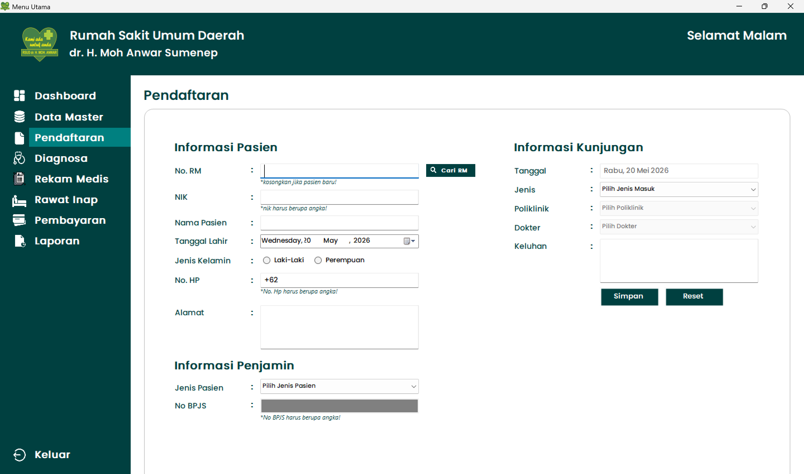
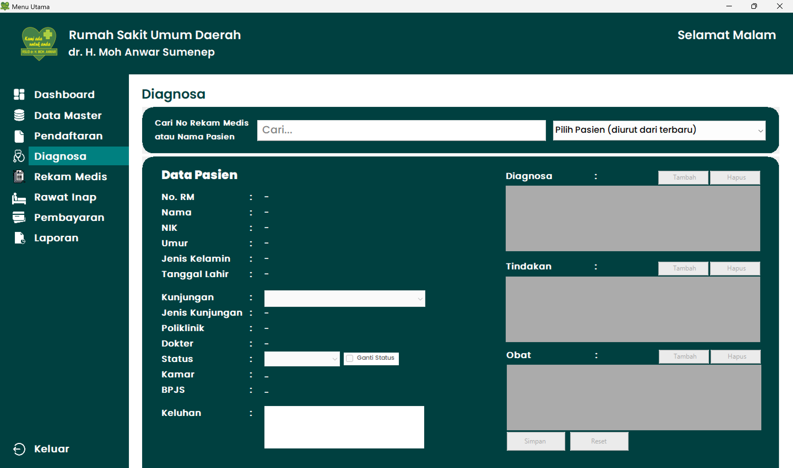
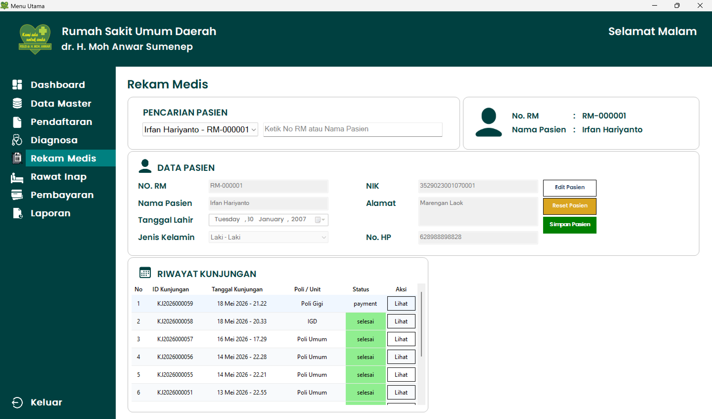
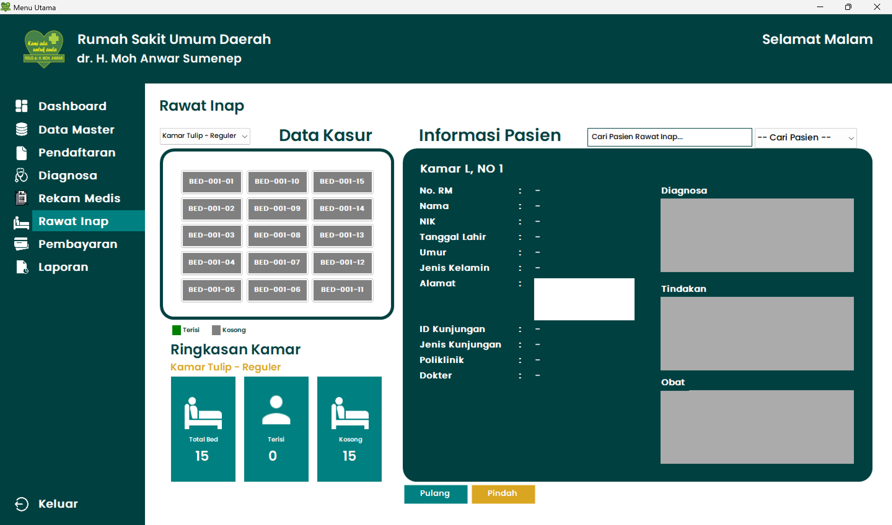
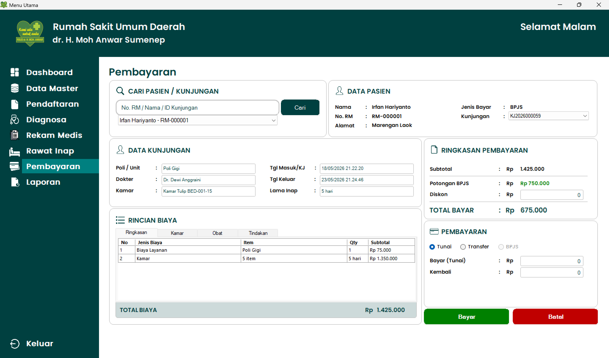
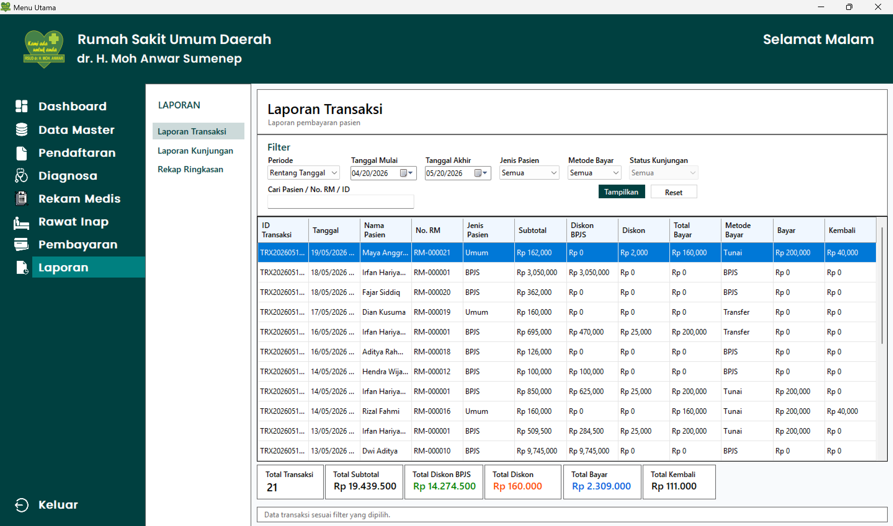

<div align="center">

# 🏥 RSUD-SYSTEM

### Sistem Informasi Rumah Sakit Berbasis Desktop

Aplikasi desktop berbasis **C# Windows Forms** yang dirancang untuk membantu proses administrasi rumah sakit, mulai dari pengelolaan data master, pendaftaran pasien, pemeriksaan, rekam medis, rawat inap, pembayaran, hingga penyajian laporan.


</div>

---

# 📖 Tentang Project

**RSUD-SYSTEM** merupakan aplikasi Sistem Informasi Rumah Sakit (Hospital Information System/HIS) berbasis desktop yang dikembangkan menggunakan **C# Windows Forms** dan **MySQL**.

Aplikasi ini bertujuan membantu proses administrasi rumah sakit agar lebih terstruktur, efisien, dan mudah dikelola, mulai dari proses pendaftaran pasien hingga transaksi pembayaran dan penyusunan laporan.

---

# ✨ Fitur Utama

## 🔐 Login

- Login Administrator
- Validasi Username & Password
- Manajemen Sesi Pengguna
- Sapaan otomatis berdasarkan waktu

---

## 📊 Dashboard

Halaman utama aplikasi yang berfungsi sebagai pusat navigasi menuju seluruh menu sistem.

📷



---

## 🗂 Data Master

Mengelola seluruh data utama yang digunakan oleh sistem.

**Modul**

- 👤 Data Pasien
- 👨‍⚕️ Data Dokter
- 🏥 Data Poli
- 🛏 Data Kamar
- 🛌 Data Bed
- 💊 Data Obat
- 👨‍💼 Data Admin

📷



---

## 📝 Pendaftaran

Mengelola proses registrasi pasien.

**Fitur**

- Pendaftaran Pasien
- Data Kunjungan
- Pencarian Pasien
- Riwayat Pendaftaran

📷



---

## 🩺 Diagnosa

Digunakan untuk mencatat hasil pemeriksaan pasien.

**Fitur**

- Input Diagnosa
- Pemeriksaan Pasien
- Tindakan Medis
- Resep Obat

📷



---

## 📄 Rekam Medis

Menyimpan seluruh riwayat pemeriksaan pasien.

**Fitur**

- Riwayat Pemeriksaan
- Riwayat Diagnosa
- Riwayat Pengobatan
- Riwayat Tindakan

📷



---

## 🛏 Rawat Inap

Mengelola proses rawat inap pasien.

**Fitur**

- Pemilihan Kamar
- Informasi Ketersediaan Bed
- Check In
- Check Out
- Histori Kamar

📷



---

## 💳 Pembayaran

Mengelola seluruh transaksi pembayaran pasien.

**Fitur**

- Perhitungan Tagihan
- Pembayaran
- Riwayat Transaksi
- Cetak Kwitansi

📷



---

## 📈 Laporan

Menyediakan berbagai laporan administrasi rumah sakit.

**Fitur**

- Laporan Pasien
- Laporan Dokter
- Laporan Pendaftaran
- Laporan Rekam Medis
- Laporan Pembayaran

📷



---

# 🗄 Struktur Database

Database **`rsud_db`** terdiri dari **15 tabel**.

| Tabel | Keterangan |
|--------|------------|
| admin | Data administrator |
| pasien | Data pasien |
| dokter | Data dokter |
| poli | Data poli |
| kamar | Data kamar |
| bed | Data tempat tidur |
| kunjungan | Data kunjungan pasien |
| diagnosa | Data diagnosa pasien |
| rekam_medis | Data rekam medis |
| obat | Data obat |
| resep | Data resep obat |
| tindakan | Master tindakan medis |
| data_tindakan | Detail tindakan pasien |
| histori_kamar | Riwayat penggunaan kamar |
| transaksi | Data pembayaran pasien |

---

# 🔄 Alur Sistem

```text
Login
   │
   ▼
Dashboard
   │
   ├── Data Master
   │      ├── Pasien
   │      ├── Dokter
   │      ├── Poli
   │      ├── Kamar
   │      ├── Bed
   │      └── Obat
   │
   ├── Pendaftaran Pasien
   │
   ├── Diagnosa
   │
   ├── Rekam Medis
   │
   ├── Rawat Inap
   │
   ├── Pembayaran
   │
   └── Laporan
```

---

# 🔗 Relasi Antar Modul

```text
Pasien
   │
   ├── Kunjungan
   │      │
   │      ├── Diagnosa
   │      │      │
   │      │      ├── Rekam Medis
   │      │      ├── Resep
   │      │      └── Data Tindakan
   │      │
   │      └── Transaksi
   │
   └── Histori Kamar
```

---

# 🛠 Teknologi yang Digunakan

| Teknologi | Keterangan |
|-----------|------------|
| Bahasa Pemrograman | C# |
| Framework | Windows Forms (.NET Framework) |
| Database | MySQL |
| IDE | Microsoft Visual Studio |
| Library | MySql.Data 6.7.9 |

---

# 📂 Struktur Project

```text
RSUD-SYSTEM
│
├── preview/
│   ├── dashboard.png
│   ├── data-master.png
│   ├── pendaftaran.png
│   ├── diagnosa.png
│   ├── rekam-medis.png
│   ├── rawat-inap.png
│   ├── pembayaran.png
│   └── laporan.png
│
├── database/
│   └── rsud_db.sql
│
├── RSUD-SYSTEM/
├── RSUD-SYSTEM.sln
└── README.md
└── LICENSE.md
```

---

# 🚀 Cara Menjalankan

## 1. Clone Repository

```bash
git clone https://github.com/rtwone/RSUD-SYSTEM.git
```

## 2. Buka Project

Buka file berikut menggunakan **Microsoft Visual Studio**.

```text
RSUD-SYSTEM.sln
```

## 3. Import Database

Import file:

```text
database/rsud_db.sql
```

ke dalam MySQL menggunakan phpMyAdmin atau MySQL Workbench.

## 4. Konfigurasi Database

Sesuaikan konfigurasi koneksi database pada file:

```text
koneksi.cs
```

Contoh:

```csharp
Server=localhost;
Database=rsud_db;
Uid=root;
Pwd=;
```

## 5. Jalankan Project

Build project, kemudian jalankan menggunakan Visual Studio.

---

# 📌 Catatan

- Dibuat sebagai media pembelajaran dan pengembangan aplikasi desktop.
- Menggunakan database MySQL.
- Direkomendasikan menggunakan Microsoft Visual Studio.
- Seluruh data tersimpan pada database MySQL.

---

# 👨‍💻 Developer

**Irfan Hariyanto**

📧 Mahasiswa Universitas Wiraraja

🌐 GitHub: https://github.com/rtwone

---

# 📄 Lisensi

Project ini dilisensikan di bawah **MIT License**.

Silakan lihat file [LICENSE](LICENSE.md) untuk informasi lebih lanjut.

<div align="center">

### ⭐ Jangan lupa berikan Star jika repository ini bermanfaat!

Terima kasih telah mengunjungi repository ini.

</div>
